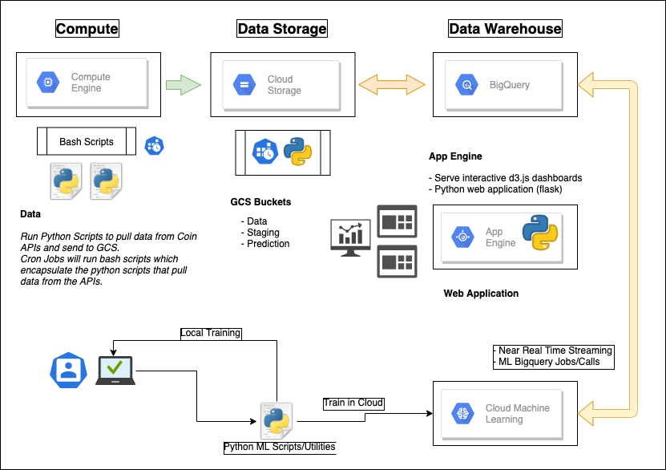

# Crypto Cloud Project

The goal of this project is to stand up custom dashboards and a 
python web application that can display custom made d3.js graphs.

We will eventually take this data and process it to develop ML
models that can predict coin prices and volatility using historical
and current datasets. 

This project contains scripts used to run data to GCS buckets where they
can be queried in near-realtime by Bigquery. 

